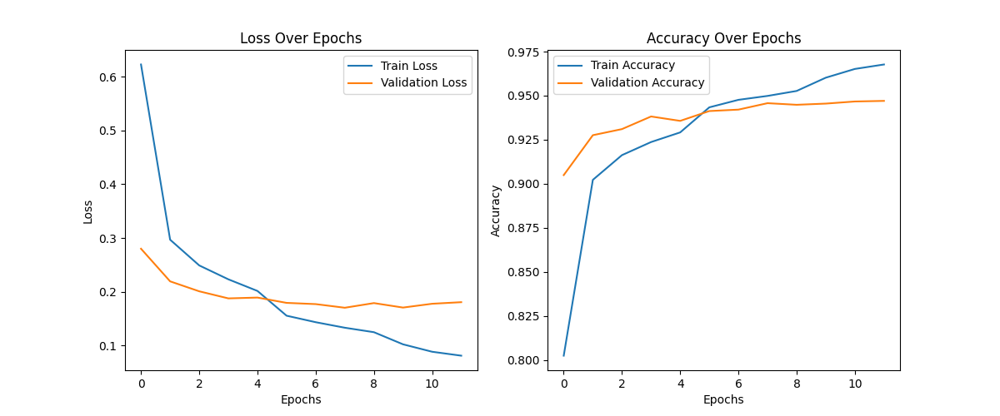

# **Handwritten Letter Recognition**
A deep learning-powered **handwritten letter recognition** model that allows users to draw **uppercase letters (A-Z)** on a canvas and a trained CNN model will predict them.

## **✅ Features**
✔ Users can **draw letters** on an interactive canvas  
✔ **Preprocessing** done with **OpenCV** to improve recognition  
✔ Predictions using a **trained Convolutional Neural Network (CNN)**  
✔ Model trained on the **EMNIST dataset**  

## **⚙️ Installation**

### **1️⃣ Clone the Repository**
```bash
git clone https://github.com/LNikolov01/handwritten_letter_recognition.git
cd handwritten_letter_recognition
```

### **2️⃣ Install Dependencies**
```bash
pip install -r requirements.txt
```

## **🚀 Usage**

### **Run the Application**
```bash
python3 app.py
```
- Draw an **uppercase letter (A-Z)** in the window that appears.  
- Press **'s'** to classify the letter. (Or **'q'** to quit)  
- The program will print the **recognized letter and confidence score**.

## **📊 Example Output**
```
Predicted Letter: W
Confidence: 96.85%
```

## **📂 Project Structure**
```
handwritten_letter_recognition/
│── app.py                 # Main application script
│── test_rotations.py      # A testing script for the preprocessing
│── train_model_letter.py  # Model training script
│── draw_letter.py         # Allows users to draw letters
│── process_image.py       # Image preprocessing for the model
│── requirements.txt       # Dependencies
│── cnn_model_letters.h5   # Trained CNN model
│── README.md              # Project documentation
```

## **🧠 Model Details**
- **Architecture:** Convolutional Neural Network (CNN)  
- **Dataset:** Trained on the **EMNIST Letters dataset** (28x28 grayscale images)  
- **Number of Classes:** **26 uppercase letters (A-Z)**  

## **📊 Model Performance**

### **✅ Test Accuracy & Loss**
- **Test Accuracy:** **94.63%**  
- **Test Loss:** **0.1966**  

### **📜 Classification Report**
```
              precision    recall  f1-score   support

           A       0.94      0.96      0.95       800
           B       0.98      0.97      0.98       800
           C       0.98      0.97      0.97       800
           D       0.96      0.96      0.96       800
           E       0.97      0.98      0.98       800
           F       0.98      0.97      0.97       800
           G       0.87      0.84      0.86       800
           H       0.95      0.96      0.95       800
           I       0.75      0.79      0.77       800
           J       0.97      0.96      0.96       800
           K       0.98      0.97      0.98       800
           L       0.78      0.76      0.77       800
           M       0.99      0.99      0.99       800
           N       0.96      0.96      0.96       800
           O       0.97      0.97      0.97       800
           P       0.98      0.99      0.99       800
           Q       0.86      0.86      0.86       800
           R       0.97      0.97      0.97       800
           S       0.98      0.98      0.98       800
           T       0.97      0.97      0.97       800
           U       0.95      0.94      0.94       800
           V       0.94      0.94      0.94       800
           W       1.00      0.98      0.99       800
           X       0.98      0.97      0.97       800
           Y       0.95      0.96      0.96       800
           Z       0.99      0.99      0.99       800

    accuracy                           0.95     20800
   macro avg       0.95      0.95      0.95     20800
weighted avg       0.95      0.95      0.95     20800
```

### **📈 Training Performance Graphs**
Below are the training accuracy and loss plots of the model:



## **🛠 Model Configuration**
```yaml
model:
  type: "CNN"
  layers:
    - Conv2D: {filters: 32, kernel_size: [3,3], activation: "LeakyReLU", input_shape: [28, 28, 1], kernel_regularizer: "l2(0.001)"}
    - MaxPooling2D: {pool_size: [2,2]}
    - Conv2D: {filters: 64, kernel_size: [3,3], activation: "LeakyReLU"}
    - MaxPooling2D: {pool_size: [2,2]}
    - Conv2D: {filters: 128, kernel_size: [3,3], activation: "LeakyReLU"}
    - Flatten: {}
    - Dense: {units: 256, activation: "LeakyReLU"}
    - Dropout: {rate: 0.5}
    - Dense: {units: 26, activation: "softmax"}
training:
  optimizer: "adam"
  loss_function: "categorical_crossentropy"
  batch_size: 32
  epochs: 20
  learning_rate_schedule: "ReduceLROnPlateau"
dataset:
  name: "EMNIST Letters"
  input_shape: [28, 28, 1]
  classes: 26
  preprocessing:
    - "Rotate -90° counterclockwise"
    - "Flip horizontally"
    - "Normalize pixel values to range [0,1]"
```

## **🔍 Challenges Faced**
During development, I faced multiple challenges and worked through them systematically:

### **Incorrect Letter Orientation**
❌ **Problem:** The EMNIST dataset stores images **rotated 90° clockwise and mirrored**  
✅ **Solution:** Applied **-90° counterclockwise rotation and horizontal flipping** to correct alignment.  

### **Real-World Testing Was Inaccurate**
❌ **Problem:** The model performed well on EMNIST but failed with real drawn letters.  
✅ **Solution:** Improved **image preprocessing** with OpenCV to better match the EMNIST format.  

### **J ↔ L Misclassification**
❌ **Problem:** The model confused "J" and "L" due to dataset quirks.  
✅ **Solution:** Verified EMNIST mappings, adjusted the training process, and fine-tuned the preprocessing.  

### **Optimizing Model Generalization**
❌ **Problem:** Severe overfitting occurred in the early training stages.  
✅ **Solution:** Used **dropout layers**, **batch normalization**, and **learning rate decay** to improve performance.  

## **Planned Future Improvements**
- ✅ Data augmentation to improve generalization
- ✅ Model training script for custom datasets
- ✅ Web-based interface with Flask
- ✅ Deployment as a web app